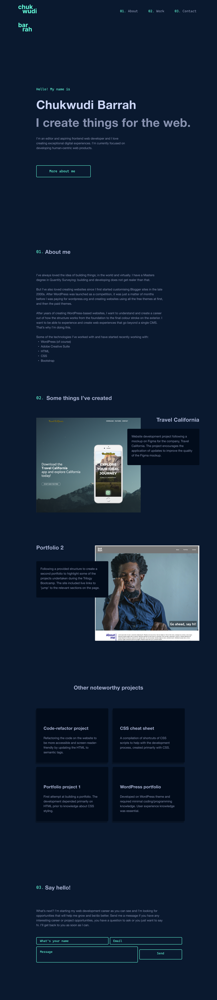

# Code Bootstrap Portfolio challenge

## Overview/description

The goal is to build my portfolio layout using Bootstrap CSS Framework.

The idea for the site was first designed on Figma to have a clearly defined idea what I was going to create.

The colors and design changed in the process of developing.

## Goals

1. A Navigation bar with a navigation menu at the top created with Bootstrap.

2. The nav menu includes links to sections of the portfolio.
  
3. A hero section is also included with a jumbotron featuring my details and skills that I have learned so far.

4. An About section shares details about me and why I am learning frontend web development.

5. A work section that displays my previous work in grid format created with Bootstrap framework cards.

6. A footer section is included with the inspiration for the site and copyright.

7. All hyperlinks and buttons have a hover effect.

8. The webpage uses zero media queries.

9. The Bootstrap-powered portfolio will be deployed to GitHub Pages on completion.

## Live site

See the final version of the site here: https://chukwudibarrah.github.io/bootstrap-portfolio/
